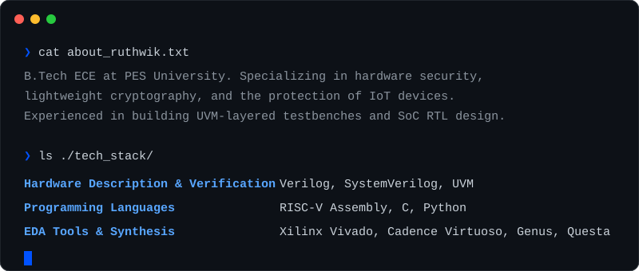

  

 

  

 

  

 

### 🔬 Featured Proof of Work

| Project | Summary | Technologies |
| :--- | :--- | :--- |
| **[Secure Testing of IPs in SoC Design](https://github.com/RUTHWIKREDDY756)** `Active` | System-level RTL architecture integrating multiple IP cores with AXI-based interfaces for scalable inter-IP communication. | Verilog · SystemVerilog · RTL |
| **[2.5D IC Packaging & Interposer Design](https://github.com/RUTHWIKREDDY756)** `Active` | Integrated Hardware Security Module (HSM) architecture within a 2.5D packaging framework. | Cadence · VLSI · Hardware Security |
| **[BIST Architecture Design & Verification](https://github.com/RUTHWIKREDDY756)** `Completed` | Designed LFSR-based test pattern generator and MISR-based analyzer; achieved +9.25ns positive timing slack (90nm). | Verilog · Cadence Genus (90nm) |
| **[ASCON / ISAP Hardware Implementation](https://github.com/RUTHWIKREDDY756)** `Completed` | Verilog RTL for ASCON permutation verified against NIST test vectors using AI-assisted layered testbenches. | Verilog · NIST VHDL · AI Testbenches |
| **[SIMON Cipher Verification](https://github.com/RUTHWIKREDDY756)** `Completed` | Built layered SystemVerilog testbenches (generator, driver, scoreboard) utilizing randomized stimulus. | SystemVerilog · Siemens Questa |

 

### 📬 Connect

**[LinkedIn (venkat-ruthwik-reddy-mutukundu)](https://linkedin.com/in/venkat-ruthwik-reddy-mutukundu)** · **[Email](mailto:ruthwikreddy756@gmail.com)**

 

  <small>B.Tech ECE @ PES University · CNR Rao Scholarship Recipient</small>

